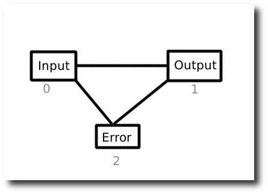

## Shell脚本编程

### Shell的重定向问题

这一部分主要涉及输入/输出的重定向，利用文件进行输入和输出，重定向至标准输出和标准错误以及从文件描述符(fd)中读出和写入数据。

1. Input and Output

所有的指令都具有输入Input和输出Output，一般情况(默认模式)下利用键盘输入，指令的结果通过屏幕输出。但是，Linux也允许我们利用文件进行输入和输出，把这种改变默认输入和输出的操作叫做I/O重定向Redirection，其符号为>。

Linux系统中一切皆文件，其对应的标准输入/输出/错误如下图所示。


* 0:Input - Keyboard(stdin)
* 1:Output - Screen(stdout)
* 2:Error - Screen(stderr)

说明：0,1,2三个数值均符合POSIX标准，可被文件描述符fd所识别。

举例说明:
```
＃ 利用cat读入指定文件
cat < fileName
# 输出至指定文件
date > date.txt
rm /tmp/file1.txt 2>error.txt
```

> 标准输入

标准输入（键盘）是默认的输入方式，所有的指令都采取默认方式读取输入。<是标准输入的重定向符号，其语法如下：
```
commond < filename
```


>　标准输出

标准输出（屏幕）是写入/显示指令运行结果的默认方式。>是标准输出的重定向符号，其语法如下：
```
commond > outputfilename
```


**注意**：1)若输出文件不存在，则创建文件，若输出文件存在，则重写文件。2)单独使用>可以创建空文件，例如`>file.txt`。

> 标准错误

标准错误（屏幕）可以输出所有的系统错误信息，是默认的错误信息输出方式。2>是标准错误的重定向符号，其语法如下：
```
commond 2> error.txt
# 将错误追加到文件的最后
commond-name 2>> error.txt
```


**注意**:使用2>>符号可以将标准错误输出追加到文件的最后。

> /dev/null：字符特殊文件

字符特殊文件/dev/null和/dev/zero可以写入系统无用的输出，所写入的内容都会永远消失，不被Shell识别。其语法如下：
```
# 将标准输出重定向至/dev/null
commond > /dev/null
# 将标准错误重定向至/dev/null
commond 2> /dev/null
# 将标准输出以及标准错误重定向至/dev/null
commond &> /dev/null
```
应用实例：
```
grep vivek /etc/password > /dev/null && echo "Vivek found" || echo "Vivek not found"
```

> Here Documents(嵌入文档)

嵌入文档作为重定向的一种方式，指示Shell从源文件的当前位置读取输出，直到遇到只包含一个单词的文本行时结束。在该过程中读到的所有文本行都将作为某一个命令的标准输入使用。其语法如下：
```
commond <<HERE
msg_body
HERE
```
应用实例：
```
# 利用shell脚本访问数据库
mysql -u root <<EOF
use mysql
select * from user;
exit
EOF
```
> Here strings

Here strings可以看做Here Documents的一种定制形式，其语法如下：
```
commond <<<$word
```
说明："$word"是Shell变量，可以作为标准输入。
应用实例：
字符串匹配
```
#!/bin/bash
var="Neither in this world nor elsewhere is there any happiness in store for him who always doubts."
grep "nor" <<<$var >/dev/null && echo "Found" || echo "Not found"
```
查找激活状态的网络接口
```
wc -w <<<$(netstat -i | cut -d" " -f1 | egrep -v "^Kernel|Iface|lo")
```
